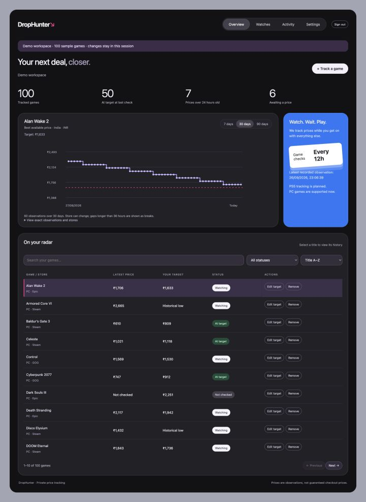
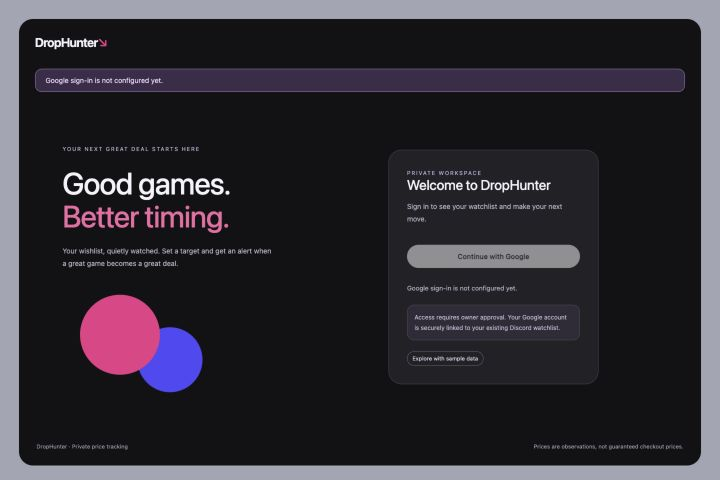
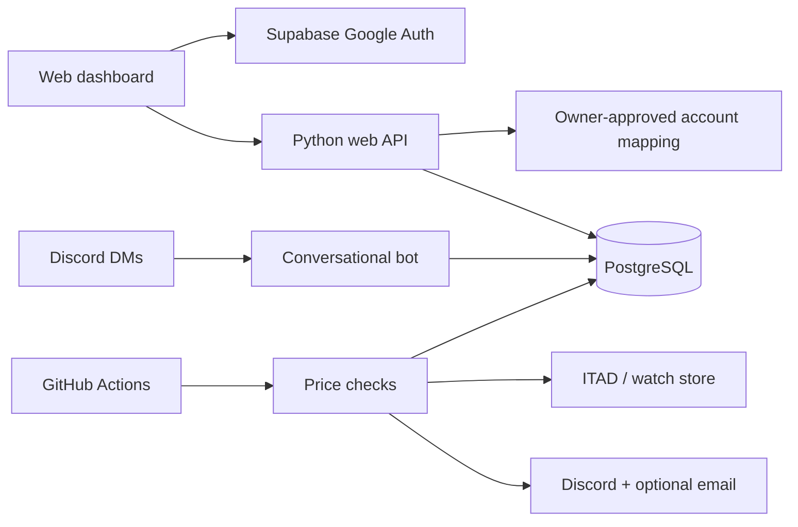

# DropHunter

**Your wishlist, quietly watched.**

A private game and watch price tracker with a web dashboard, conversational Discord bot,
and scheduled deal alerts. Track PC games across stores supported by IsThereAnyDeal,
set a target in INR, and get notified when the price qualifies.

[](https://github.com/thomasjv799/DropHunter/actions/workflows/ci.yml)

[Quick start](#quick-start) · [Dashboard setup](docs/dashboard.md) · [Tracker operations](docs/operations.md) · [Issues](https://github.com/thomasjv799/DropHunter/issues)



*Actual application screenshot using the isolated 100-game demo. Prices, accounts, and counts are sample data.*

## What you can do

- **Manage your watchlist:** search, filter, sort, and paginate games; add a confirmed PC match, edit its target, or remove it. The web app permits up to 100 tracked games per user.
- **Explore prices:** select a game for its 7-, 30-, or 90-day history. See the store and timestamp behind each observation, with stale prices and history gaps shown explicitly.
- **Get deal alerts:** scheduled checks send Discord DMs, with optional per-user email. Use a custom target or the provider's historical low. Alerts still send when AI commentary is unavailable.
- **Use natural language:** manage games and Swiss Time House watches through an approved Discord DM conversation, with per-user memory.
- **Keep access private:** Google sign-in requires owner approval and an explicit link to the user's Discord watchlist. Users only access their own records.
- **Run where it fits:** game checks run on GitHub-hosted or self-hosted runners; the dashboard and bot deploy independently.

## Screenshots

<details>
<summary>Google sign-in and account approval</summary>



The screen shows the current unconfigured local state. Live sign-in requires Google OAuth
credentials, Supabase provider setup, and an approved account mapping. The demo needs none of these.

</details>

## Quick start

### Explore the dashboard without credentials

Requires **Python 3.11** and **Node.js 22**. From the repository root:

```sh
python3.11 -m venv .venv
. .venv/bin/activate
pip install -r requirements-web.lock
npm --prefix frontend ci
npm --prefix frontend run build
flask --app 'web.app:create_app()' run --port 8081
```

Open **http://127.0.0.1:8081** and choose **Explore with sample data**.
Demo edits stay in that browser session and reset when the page reloads.

### Connect live data

Follow [dashboard setup](docs/dashboard.md) for server configuration, the additive database
migration, Google OAuth, account approval/revocation, and production hosting.

For the conversational bot and GitHub Actions checks, follow [tracker operations](docs/operations.md).
That guide includes required secrets, database setup, commands, email delivery, and home-server recovery.

## Deployment at a glance

| Component | Where it runs | Important dependency |
|---|---|---|
| Game price checks | GitHub Actions; cloud runner by default | PostgreSQL, ITAD key, Discord bot token |
| Web dashboard | Separate web service; cloud container or home server | Supabase Google Auth and approved account mappings for live access |
| Conversational bot | Persistent server | Discord connection and configured AI provider |
| Watch price checks | Self-hosted runner by default; opt-in | Runner that can reach the watch store |
| Database backup | Optional self-hosted workflow | Explicitly enable after reconciling cloud/home data |

Game checks are scheduled every 12 hours at **00:00 and 12:00 UTC**; GitHub can delay scheduled runs.
GitHub Actions does not host the interactive dashboard or keep the conversational bot online.

**Current scope:** PC games are supported. [PS5 tracking](https://github.com/thomasjv799/DropHunter/issues/13)
awaits a suitable pricing provider. The web dashboard lists watches; watch creation and conversational
chat remain in the bot. [Live dashboard activation](https://github.com/thomasjv799/DropHunter/issues/11)
is tracked separately from the implemented UI.

## How it fits together



The web API verifies the Supabase identity and checks approval before querying user-scoped data.
Database credentials stay server-side. Existing Discord ownership is preserved.
Use Supabase's `public` schema or the home server's `drophunter` schema.

Charts show the **best recorded store price at each check**, not a single store's complete history.
The selected store can change, and gaps are not filled with invented prices.

## Development and checks

With the virtual environment activated:

```sh
pip install -r requirements.txt -r requirements-dev.txt -r requirements-web.txt
python -m pytest -q
ruff check .
npm --prefix frontend ci
npm --prefix frontend test
npm --prefix frontend run build
# First browser-test run:
cd frontend
npx playwright install chromium
npm run test:e2e
```

CI runs Python tests against disposable PostgreSQL 17 databases in both supported schemas,
plus frontend unit tests, the production build, and browser tests. Set `TEST_DATABASE_URL`
to a **disposable database** to run database tests locally; otherwise those tests are skipped.
Never use a production database for tests.

## Repository map

| Path | Purpose |
|---|---|
| [`frontend/`](frontend/) | Vite dashboard, Supabase sign-in, browser tests |
| [`web/`](web/) | Flask API, scoped queries, owner approval CLI |
| [`bot/`](bot/) · [`ai/`](ai/) | Discord commands, LangGraph conversations, AI providers |
| [`cron/`](cron/) · [`utils/`](utils/) | Scheduled checks, price sources, notifications |
| [`db/`](db/) · [`supabase/migrations/`](supabase/migrations/) | Database clients, schemas, additive migrations |
| [`tests/`](tests/) | Python and PostgreSQL integration tests |
| [`Dockerfile.web`](Dockerfile.web) · [`Dockerfile`](Dockerfile) | Independent web and bot images |

## Documentation

- [Dashboard setup, Google sign-in, approvals, deployment, and rollback](docs/dashboard.md)
- [Discord commands, cloud scheduling, notifications, and home-server recovery](docs/operations.md)
- [Dashboard design and security requirements](docs/superpowers/specs/2026-09-26-dashboard-design.md)
- [Open issues and planned improvements](https://github.com/thomasjv799/DropHunter/issues)
